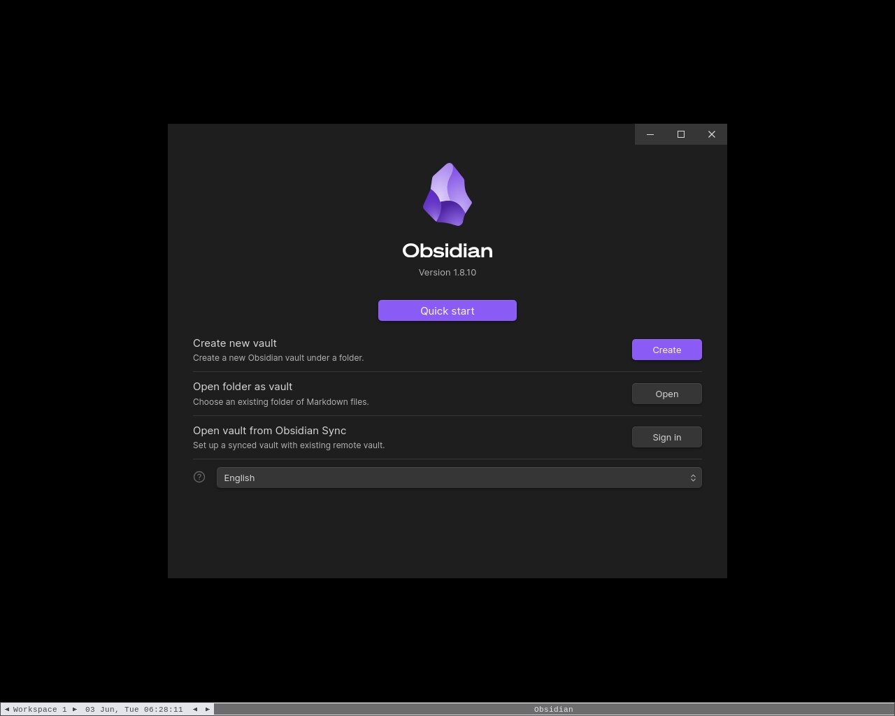
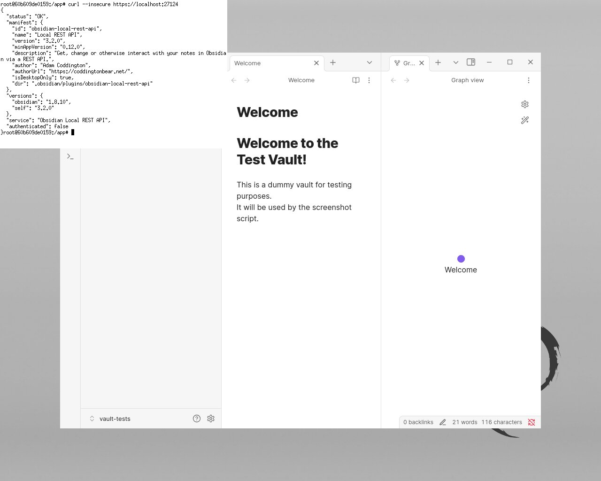

# mcp-obsidiant

## Quick Development Start

```bash
# install dependencies
bun install

# run MCP server locally
bun run src/index.ts
```

## Dockerized Obsidian for Automated Testing

| Startup | Verification |
| --- | --- |
|  |  |

```bash
# run script for getting a visual feedback on Obsidian inside the docker container
./dockerize/test_obsidian_gui.sh

# Screenshot will be saved in the 'reports/screenshots' directory, relative to project root
```

## Troubleshooting

```bash
# Run MCP server locally in DEBUG mode
DEBUG=mcp:* bun run src/index.ts --config ./configs/config.wsl2.jsonc
```

### Verify that Obsidian REST API is running (Windows Host)

Run in Windows CMD terminal:

```shell
# windows CMD, verify that port is listening (that rest api is running)
netstat -an | findstr 27124

# curl with --insecure to accept self-signed certificate
curl --insecure https://localhost:27124

# If using WSL with Obsidian REST API running on Windows host
curl --insecure https://host.docker.internal:27124
```

### Verify Windows Firewall

Run GUI:

```shell
# Windows Defender Firewall / Inbound Rules. Press Win+R and type WF.msc or firewall.cpl
WF.msc
firewall.cpl # and then press 'Advanced settings'
```

Run in Windows PowerShell as Administrator:

```shell
# Add firewall rule to allow port 27124 (Run in Admin PowerShell)
New-NetFirewallRule -DisplayName "WSL2 Obsidian REST API" -Direction Inbound -LocalPort 27123,27124 -Protocol TCP -Action Allow

# Add firewall rule to allow port 6274 (Run in Admin PowerShell)
New-NetFirewallRule -DisplayName "WSL2 MCP Inspector" -Direction Inbound -LocalPort 6274 -Protocol TCP -Action Allow

# To open MCP Inspector in browser, do not use 127.0.0.1!
open https://localhost:6274 # macOs
start https://localhost:6274 # for windows CMD
```

Run in Windows CMD terminal:

```shell
# check firewall rules (CMD) that manage 27124 port
netsh advfirewall firewall show rule name=all | findstr /C:"Rule Name" /C:"LocalPort" /C:"RemotePort" | findstr /C:"27124"

# display rules that has WSL2 keyword in own name
netsh advfirewall firewall show rule name=all | grep -A 13 WSL2

# display rule definition by port number (4 line after, 9 lines before)
netsh advfirewall firewall show rule name=all | grep -A 4 -B 9 27124
```

### Verify Obsidian REST API is running (WSL2 Ubuntu)

#### Quick test

```bash
# Get Windows host IP address (typically the first nameserver in resolv.conf)
WINDOWS_HOST_IP=$(cat /etc/resolv.conf | grep nameserver | awk '{print $2}')

# Get the gateway IP for default route
WSL_GATEWAY_IP=$(ip route show | grep -i default | awk '{ print $3}')

# use gateway IP to access Obsidian REST API (windows host ip can be different)
curl --insecure https://${WSL_GATEWAY_IP}:27124
```

#### Disable/enable firewall

Execute in Windows PowerShell as Administrator:

```shell
# Temporarily turn off firewall (for testing ONLY, not recommended for regular use)
Set-NetFirewallProfile -Profile Domain,Public,Private -Enabled False

# Restore Firewall state
Set-NetFirewallProfile -Profile Domain,Public,Private -Enabled True
```
