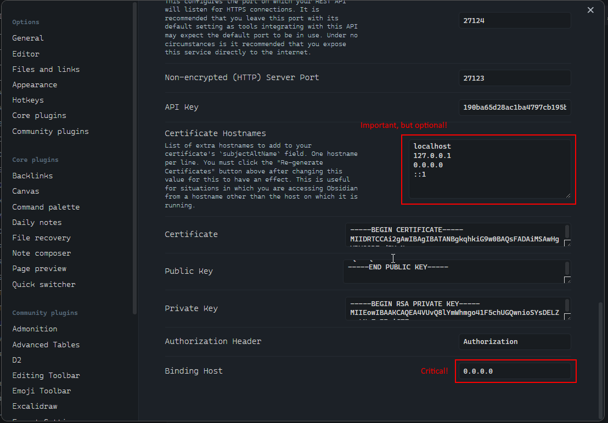

# Assets

## Obsidian Setup

Go To: Settings -> Community plugins / Local REST API

Check - "Show advanced settings"

Change "Binding Host" to `0.0.0.0` - this will allow the API to be accessible from any machine (we need this to allow docker instance to access the API).

> Notes: Highly recommende to activate firewall, to protect API from unauthorized access. We still have one last line of defense active - the API key.



## Make Obsidian Local REST Server API trusted

```bash
# download certificate
curl https://127.0.0.1:27124/obsidian-local-rest-api.crt -o obsidian-local-rest-api.crt
ln -s obsidian-local-rest-api.crt rootCA.crt

# convert certificate to PEM format
openssl x509 -in obsidian-local-rest-api.crt -out rootCA.pem -outform PEM

# install CA ROOT certificates from repo
CAROOT=$(pwd) mkcert -install
```

## OpenAPI definition

```bash
# download definition of the API (swagger definition)
curl https://coddingtonbear.github.io/obsidian-local-rest-api/openapi.yaml -o openapi-obsidian-local-rest-api.yaml

# generate Client code from OpenAPI definition
# ref: https://github.com/hey-api/openapi-ts
npx @hey-api/openapi-ts \
  -i https://coddingtonbear.github.io/obsidian-local-rest-api/openapi.yaml \
  -o src/client \
  -c @hey-api/client-fetch

# generate Server code from OpenAPI definition
# ref1: https://github.com/openapitools/openapi-generator
# ref2: https://openapi-generator.tech/docs/installation/
npx @openapitools/openapi-generator-cli generate \
  -i openapi-obsidian-local-rest-api.yaml \
  -o src/client \
  -g typescript-axios
```

## Run MCP Debug

```bash
bunx @modelcontextprotocol/inspector bun run src/index.ts

open https://localhost:6274
```
