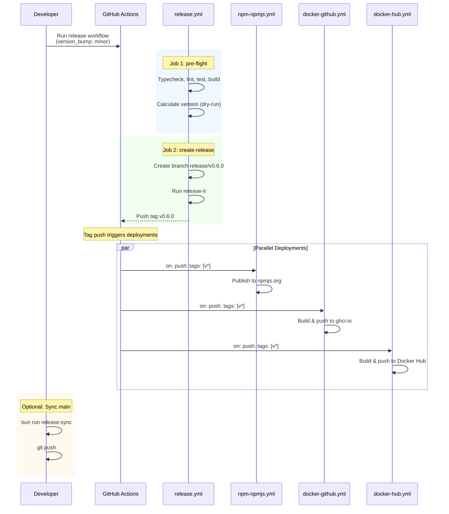

# Release Runbook

## Architecture Overview

**Key Principles:**

- Version tags go on **release branches** (not main/master)
- Release branches are **never merged** to main/master
- Release branches can be **deleted** (tags keep commits alive)
- Main branch version is **arbitrary** (manually updated via helper)
- CHANGELOG is **computed from git tags + conventional commits**
- release-it handles most work (bump, CHANGELOG, commit, tag, push, GitHub Release)

**Workflow Diagram:**

```text
main (v0.5.1)
  │
  ├─→ Release Workflow (GitHub Actions)
  │     (version_bump: patch)
  │
  ├─→ Job 1: pre-flight
  │     - Typecheck, lint, tests, build
  │     - Calculate version
  │
  ├─→ Job 2: create-release
  │     - Create release branch: release/v0.5.2
  │     - Run release-it (does everything)
  │         - Bump version
  │         - Generate CHANGELOG
  │         - Commit
  │         - Tag
  │         - Push
  │         - Create GitHub Release
  │
  ├─→ Deployments Trigger (automatic)
  │     - npm-npmjs.yml (npmjs.org)
  │     - docker-github.yml (GHCR)
  │     - docker-hub.yml (Docker Hub - auto on tag)
  │
  ├─→ Manual Developer Action (optional)
  │     bun run release:sync
  │     ├─→ Updates package.json on main to v0.5.2
  │     └─→ Cherry-picks CHANGELOG.md to main
  │
  └─→ Automated Cleanup (after 7 days)
        Deletes release/v0.5.2 branch
        (Tag v0.5.2 remains permanent)
```

### Workflow Sequence Diagram



## Quick Start

### 1. Create Release

```bash
# Navigate to GitHub Actions → Release workflow: https://github.com/OleksandrKucherenko/mcp-obsidian-via-rest/actions/workflows/release.yml
# Click "Run workflow"
# Select version bump type (major/minor/patch)
# (Optional) Enable "Dry run" for testing
# Click "Run workflow"
```


Or use GH command line tool:

```bash
# Standard release with version bump type
gh workflow run release.yml -f version_bump=patch

# Or for minor/major
gh workflow run release.yml -f version_bump=minor
gh workflow run release.yml -f version_bump=major

# Dry run (testing without actual release)
gh workflow run release.yml -f version_bump=patch -f dry_run=true
```

### Release Types Reference

The release workflow supports several release patterns. Use `version_bump`, `prerelease`, and `custom_version` inputs together:

| Scenario | Command | Result |
|----------|---------|--------|
| **Stable releases** | | |
| Patch release | `gh workflow run release.yml -f version_bump=patch` | `v0.5.2` (from v0.5.1) |
| Minor release | `gh workflow run release.yml -f version_bump=minor` | `v0.6.0` (from v0.5.x) |
| **Major release (1.0.0)** | `gh workflow run release.yml -f version_bump=major` | `v1.0.0` (from v0.x.x) |
| Auto (from conventional commits) | `gh workflow run release.yml -f version_bump=auto` | `v0.6.0` (if `feat:` commits) |
| **Pre-releases (with bump)** | | |
| **Beta with patch increment** | `gh workflow run release.yml -f version_bump=patch -f prerelease=beta` | `v0.9.1-beta.0` (from v0.9.0) |
| Alpha with minor increment | `gh workflow run release.yml -f version_bump=minor -f prerelease=alpha` | `v0.10.0-alpha.0` |
| **RC with minor increment** | `gh workflow run release.yml -f version_bump=minor -f prerelease=rc` | `v0.10.0-rc.0` |
| **Pre-release iterations (auto-increment)** | | |
| **Next beta (same version)** | `gh workflow run release.yml -f prerelease=beta` | `v0.9.0-beta.1` (from v0.9.0-beta.0) |
| Next RC (same version) | `gh workflow run release.yml -f prerelease=rc` | `v1.0.0-rc.2` (from v1.0.0-rc.1) |
| Next alpha (same version) | `gh workflow run release.yml -f prerelease=alpha` | `v0.8.0-alpha.3` (from v0.8.0-alpha.2) |
| **Custom exact versions** | | |
| Exact version | `gh workflow run release.yml -f custom_version=2.0.0` | `v2.0.0` (exact) |
| Custom pre-release | `gh workflow run release.yml -f custom_version=1.5.0-rc.1` | `v1.5.0-rc.1` (exact) |
| **Dry run (any release type)** | | |
| Dry run patch | `gh workflow run release.yml -f version_bump=patch -f dry_run=true` | Calculates without releasing |
| Dry run beta | `gh workflow run release.yml -f prerelease=beta -f dry_run=true` | Calculates beta version |

**Key Concepts:**

- **`version_bump`** - Increments version (major/minor/patch/auto), then applies prerelease if set
- **`prerelease`** - Appends `-alpha.N`, `-beta.N`, or `-rc.N` to the bumped version (N resets to 0 on bump, or auto-increments if no bump specified)
- **`custom_version`** - Sets exact version, bypassing all auto-calculation (useful for non-standard versions)
- **`dry_run`** - Shows calculated version without creating release

**SemVer Tag Verification:**

The workflow automatically validates all git tags against SemVer specification before release. Non-compliant tags (e.g., `v1.0`, `v2.x`, `latest`) are logged as warnings and ignored by release-it during version calculation.

**Pre-release iteration workflow:**

Release-it now automatically increments pre-release numbers when you omit `version_bump`:

```bash
# First beta (with bump)
gh workflow run release.yml -f version_bump=patch -f prerelease=beta
# Creates: v0.9.1-beta.0

# Second beta (auto-increment, no bump)
gh workflow run release.yml -f prerelease=beta
# Creates: v0.9.1-beta.1

# Third beta
gh workflow run release.yml -f prerelease=beta
# Creates: v0.9.1-beta.2
```

**Important:** When using just `-f prerelease=<type>` (without `version_bump`), release-it finds the latest tag with that prerelease type and increments only the prerelease number. This works across the entire repository history.

### Pre-release Version Behavior

The interaction between conventional commits and prerelease versions follows these rules:

| Commits since last tag | Command | Result |
|------------------------|---------|--------|
| Only `wip:`, `docs:`, `chore:`, etc. | `-f prerelease=beta` | `v0.9.1-beta.1` (same base, increments prerelease) |
| Has `feat:` commits | `-f prerelease=beta` | `v0.10.0-beta.0` (bumps minor, resets prerelease) |
| Has `fix:` commits | `-f prerelease=beta` | `v0.9.2-beta.0` (bumps patch, resets prerelease) |
| Any commits | `-f custom_version=0.9.1-beta.1` | `v0.9.1-beta.1` (exact, ignores commits) |

**Key point:** Conventional commits (`feat:`, `fix:`, `BREAKING CHANGE`) drive version bumps even when using `-f prerelease`. Only `wip:`, `docs:`, `chore:`, `test:`, `style:`, `refactor:`, `perf:`, `ci:`, `build:`, `revert:` are treated as "no bump".

**To stay on the same base version despite `feat:` commits:**

```bash
# Check what version will be calculated (dry run)
gh workflow run release.yml -f prerelease=beta -f dry_run=true
# Output might show: v0.10.0-beta.0

# If you want v0.9.1-beta.1 instead, use custom_version
gh workflow run release.yml -f custom_version=0.9.1-beta.1
```

**Conventional commit types and their impact:**

| Commit type | Version impact |
|-------------|----------------|
| `feat:` | minor bump |
| `fix:` | patch bump |
| `feat!:` or `BREAKING CHANGE:` | major bump |
| All other types (`wip:`, `docs:`, `chore:`, etc.) | no bump |

### 2. Verify Release

```bash
# Check GitHub Release
gh release list --limit 1

# Verify npm (release registry)
npm view @oleksandrkucherenko/mcp-obsidian --@oleksandrkucherenko:registry=https://registry.npmjs.org/

# Verify Docker
docker buildx imagetools inspect ghcr.io/oleksandrkucherenko/obsidian-mcp:latest
```

### 3. Sync Main Version (Optional)

```bash
bun run release:sync
git push
```

## Detailed Steps

### Step 0: Pre-flight Checks (Automated)

**Performed by release workflow:**

- Typecheck: `bun run checks:types`
- Lint: `bun run checks:lint`
- Unit tests: `bun test ./src`
- Build: `bun run build`

### Step 1: Choose Release Version

**Standard**: Automatic version calculation

release-it automatically calculates the version based on:

1. Latest git tag (e.g., v0.5.1)
2. Conventional commits since that tag:
   - `feat:` → minor
   - `fix:` → patch
   - `BREAKING CHANGE:` or `feat!:` → major

**Decide** version bump type: `major`, `minor`, or `patch`

### Step 2: Create Release

#### Option A: Quick Release (Trusted Changes)

**Best for:** Small bug fixes, hotfixes

**Steps:**

1. Commit changes to main branch
2. Navigate to: `.github/workflows/release.yml`
3. Click "Run workflow"
4. Select version bump type
5. Click "Run workflow"
6. Monitor workflow execution
7. Verify deployments

#### Option B: Dry Run (Testing)

**Best for:** Testing configuration before release

**Steps:**

1. Navigate to release workflow
2. Click "Run workflow"
3. Enable "Dry run mode"
4. Click "Run workflow"
5. Review calculated version and CHANGELOG
6. Adjust version bump type if needed
7. Re-run without dry run for actual release

### Step 3: Monitor Deployments

**npm (npmjs.org):**

- Triggers automatically on tag creation
- Monitor: `.github/workflows/npm-npmjs.yml`
- Approve manual job when prompted
- Verify: `npm view @oleksandrkucherenko/mcp-obsidian version`

**Docker (GHCR):**

- Triggers automatically on tag creation
- Monitor: `.github/workflows/docker-github.yml`
- Verify: `docker pull ghcr.io/oleksandrkucherenko/obsidian-mcp:0.5.2`

**Docker (Docker Hub):**

- Triggers automatically on tag creation (NEW)
- Monitor: `.github/workflows/docker-hub.yml`
- Verify: `docker pull oleksandrkucherenko/obsidian-mcp:0.5.2`

### Step 4: Sync Main Version (Manual, Optional)

After release, main branch still has the old version. To update it:

```bash
bun run release:sync
```

**What it does:**

1. Finds latest git tag (e.g., v0.5.2)
2. Fetches release branch for that version
3. Updates package.json to 0.5.2
4. Cherry-picks CHANGELOG.md from release branch
5. Shows diff for review
6. Interactive confirmation
7. Commits: "chore: sync package.json and CHANGELOG to v0.5.2"

**When to use:**

- When you want main to reflect latest release version
- When you want CHANGELOG.md on main to include latest release notes
- Before starting new feature development on main

**Why manual?**

- Developer control over timing
- Prevents unnecessary commits/PRs
- Main version is arbitrary - no strict requirement to sync

**Push instructions:**

```bash
git push
# or for protected branches
gh pr create --title "chore: sync version to v0.5.2"
```

### Step 5: Automated Cleanup

Release branches are automatically deleted after 7 days by cleanup workflow.

**Cleanup Workflow:**

- Runs weekly (scheduled every Sunday at 2 AM)
- Can also be triggered manually
- Deletes release branches older than 7 days
- **Tags are NOT deleted** (commits remain accessible)

**Manual cleanup:**

```bash
# Cleanup all release branches older than default (7 days)
gh workflow run cleanup.yaml -f run_branch_cleanup=true

# Cleanup with custom threshold
gh workflow run cleanup.yaml -f run_branch_cleanup=true -f branch_cleanup_days=3
```

## Common Scenarios

### Quick Patch Release

**When:** Small bug fix, hotfix

**Steps:**

1. Commit changes and merge to main
2. Run release workflow with `version_bump: patch`
3. Verify deployments
4. Done! (Main version sync is optional)

### Feature Release with Review

**When:** New feature, breaking changes, significant updates

**Steps:**

1. Create feature branch with changes
2. Test thoroughly
3. Merge feature branch to main
4. Run release workflow with `version_bump: minor` (or major)
5. Verify deployments
6. Optionally sync main version
7. Optionally run: `bun run release:sync`

### Hotfix from Older Release

**When:** Urgent fix needed for v0.5.2, main has moved to v0.6.0

**Steps:**

1. Checkout the old tag: `git checkout v0.5.2`
2. Create hotfix branch from that tag: `git checkout -b hotfix/v0.5.3-critical-bug`
3. Apply fix and commit with conventional commit: `git commit -m "fix: critical bug description"`
4. Push hotfix branch: `git push -u origin hotfix/v0.5.3-critical-bug`
5. Run release workflow **from the hotfix branch** (select branch in GitHub Actions UI)
6. Verify deployments
7. Cherry-pick fix to main if applicable: `git checkout main && git cherry-pick <commit-sha>`

**Important Notes:**

- The release workflow can be triggered from **any branch** (select branch in GitHub Actions "Run workflow" dropdown)
- Version is calculated from the latest tag globally, so hotfix v0.5.3 will be created correctly
- After release, consider cherry-picking the fix to main to prevent regression in future releases

### Failed Release (Tag Already Exists - Before Publishing)

**When:** Release workflow fails because tag already exists, but **nothing was published yet**

**Steps:**

1. Delete existing tag locally: `git tag -d v0.5.2`
2. Delete remote tag: `git push origin :refs/tags/v0.5.2`
3. Delete release branch: `git push origin --delete release/v0.5.2`
4. Delete GitHub Release if created: `gh release delete v0.5.2 --yes`
5. Re-run release workflow

### Partial Release Failure (Packages Already Published)

**When:** Release workflow partially succeeded - npm package or Docker images were published, then something failed

**Critical npm Restrictions:**

- npm does **NOT allow re-publishing** the same version (even after unpublish)
- npm does **NOT allow deleting** packages (only deprecation)
- There's a **24-hour cooldown** after unpublish before version can be reused
- Once a version is published, that version number is **permanently consumed**

**Recovery Steps:**

1. **Assess what was published:**

   ```bash
   # Check npm
   npm view @oleksandrkucherenko/mcp-obsidian versions --json | jq '.[-5:]'

   # Check Docker (GHCR)
   docker buildx imagetools inspect ghcr.io/oleksandrkucherenko/obsidian-mcp:0.5.2

   # Check Docker Hub
   docker buildx imagetools inspect oleksandrkucherenko/obsidian-mcp:0.5.2
   ```

2. **If npm package was published with broken version - deprecate it:**

   ```bash
   npm deprecate @oleksandrkucherenko/mcp-obsidian@0.5.2 "Broken release, use 0.5.3 instead"
   ```

3. **Clean up git artifacts:**

   ```bash
   git tag -d v0.5.2
   git push origin :refs/tags/v0.5.2
   git push origin --delete release/v0.5.2
   gh release delete v0.5.2 --yes
   ```

4. **Create hotfix release with next patch version:**
   - Fix the issue that caused the failure
   - Run release workflow with `version_bump: patch` (creates v0.5.3)
   - Update deprecation message to point to the new version

**Important:** Always move forward with a new version. Never try to reuse a version that was published to npm.

## Troubleshooting

### Release workflow fails during pre-flight checks

**Problem:** One or more checks failed

**Solution:**

1. Check workflow logs to see which check failed
2. Fix the issue locally:
   - Typecheck: `bun run checks:types`
   - Lint: `bun run checks:lint`
   - Tests: `bun test ./src`
   - Build: `bun run build`
3. Commit and push fixes to main
4. Re-run release workflow

### Release branch sync failed

**Problem:** `bun run release:sync` fails to cherry-pick CHANGELOG

**Causes:**

- Release branch was deleted (cleanup ran before sync)
- Conflicting changes in main's CHANGELOG

**Solution:**

```bash
# Option 1: Wait until release happens, sync within 7 days
# Option 2: Manually copy CHANGELOG entry from release
git log --format=%B -1 release/v0.5.2
# Paste into main's CHANGELOG
git commit -m "docs: sync CHANGELOG for v0.5.2"
```

### Tag already exists

**Problem:** Cannot create tag because it already exists

**Solution:** See [Failed Release (Tag Already Exists - Before Publishing)](#failed-release-tag-already-exists---before-publishing) or [Partial Release Failure (Packages Already Published)](#partial-release-failure-packages-already-published) in Common Scenarios above, depending on whether packages were already published.

### Deployment workflows fail

**npm (npmjs.org) fails:**

- Check `NPM_PUBLISH_TOKEN` secret in GitHub
- Verify token hasn't expired: `https://www.npmjs.com/settings/[username]/tokens`
- Update secret: `gh secret set NPM_PUBLISH_TOKEN`
- Re-run failed workflow

**Docker (Docker Hub) doesn't trigger:**

- Verify `.github/workflows/docker-hub.yml` has `tags: ["v*"]` trigger
- Check workflow logs for errors
- Manually trigger: navigate to workflow → Run workflow → Enter version

**Docker build fails:**

- Check build logs for specific error
- Verify Dockerfile is valid
- Verify all required files are present
- Re-run workflow after fixing

### Main branch version out of sync

**Problem:** main's package.json doesn't match latest release

**Solution:**
 
```bash
# Sync to latest release version
bun run release:sync
git push
```

Or leave it as-is (main version is arbitrary and doesn't affect releases)

## Expected Release Artifacts

| Artifact                  | Location        | Notes                                                 |
| ------------------------- | --------------- | ----------------------------------------------------- |
| Release branch            | GitHub          | `release/v0.5.2` (deleted after 7 days)               |
| Git tag                   | GitHub          | `v0.5.2` (permanent)                                  |
| GitHub Release            | GitHub Releases | Created from tag by release-it                        |
| npm package               | npmjs.org       | `@oleksandrkucherenko/mcp-obsidian@0.5.2`             |
| npm package               | GitHub Packages | `@oleksandrkucherenko/mcp-obsidian@0.5.2-sha-<short>` |
| Docker image (GHCR)       | ghcr.io         | Tags: `0.5.2`, `0.5`, `0`, `latest`                   |
| Docker image (Docker Hub) | docker.io       | Tags: `0.5.2`, `0.5`, `0`, `latest`                   |

## Reference

**Workflow Files:**

- `.github/workflows/release.yml` - Main release workflow (2 jobs)
- `.github/workflows/cleanup.yaml` - Cleanup workflows (4 jobs)
- `.github/workflows/npm-npmjs.yml` - npm publishing
- `.github/workflows/docker-github.yml` - Docker builds (GHCR)
- `.github/workflows/docker-hub.yml` - Docker builds (Docker Hub)

**Scripts:**

- `src/scripts/sync-version.ts` - Sync main version + CHANGELOG
- `assets/ci_cleanup_release_branches.js` - Release branch cleanup
- `assets/ci_cleanup_docker_images.js` - Docker image cleanup
- `assets/ci_cleanup_npm_package.js` - NPM package deprecation

**Configuration:**

- `.release-it.release-branch.jsonc` - release-it config for CI
- `.release-it.jsonc` - release-it config for local use
