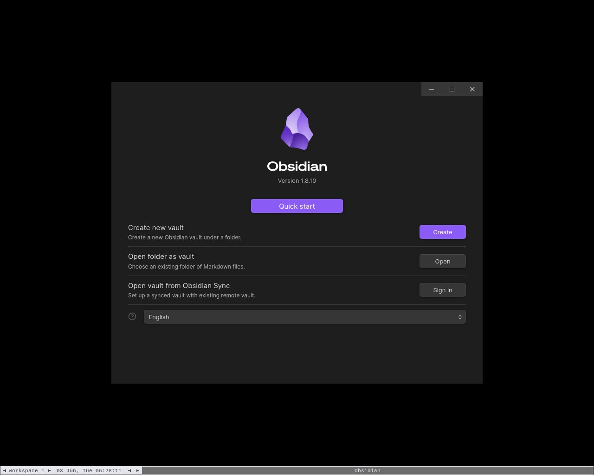
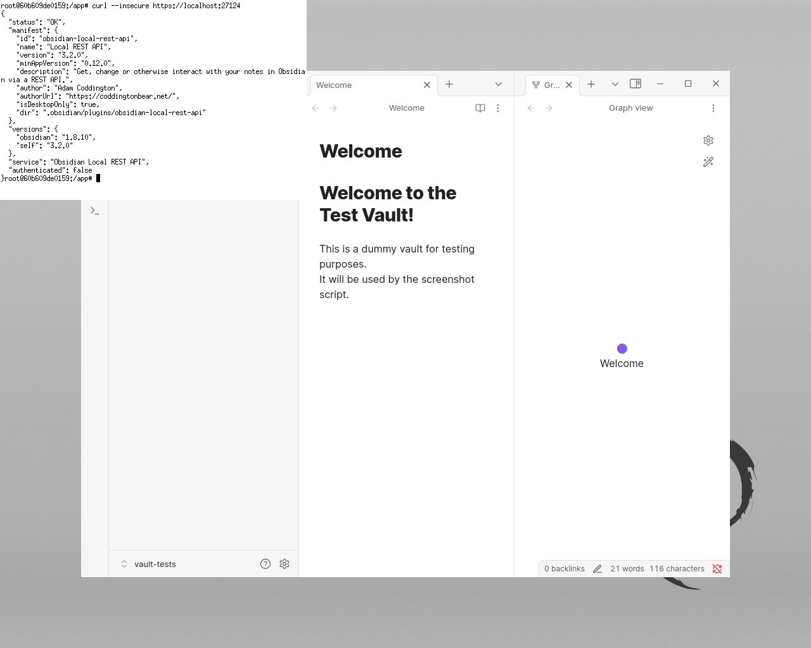
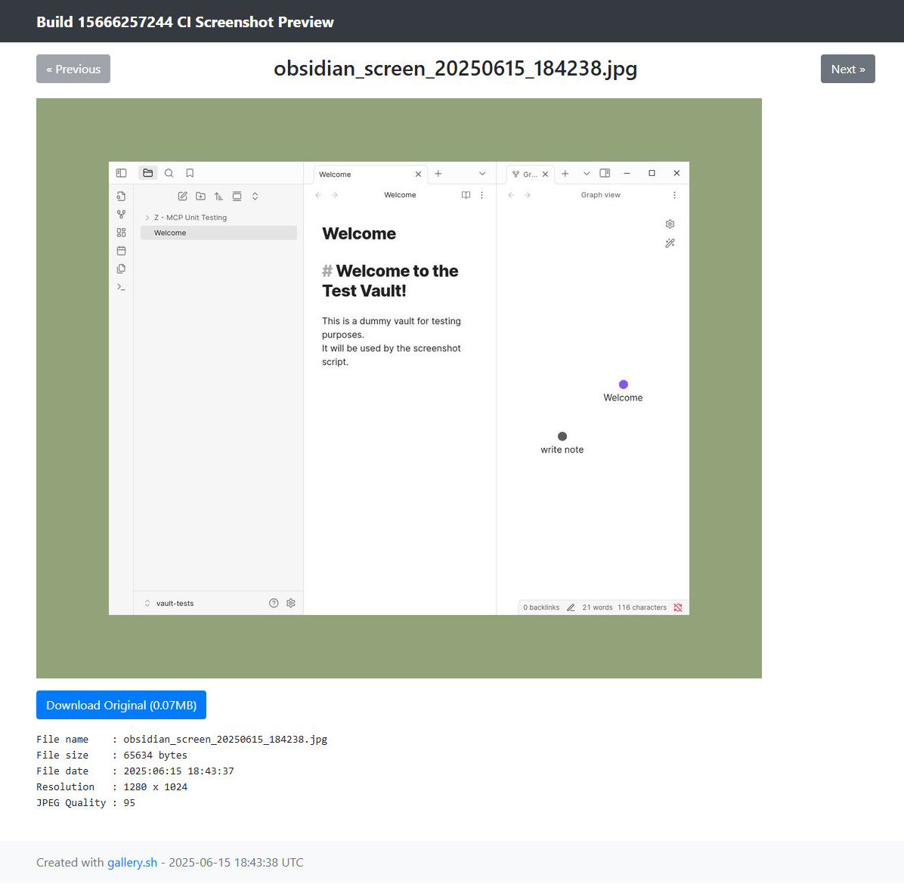

# Dockerized Obsiadian Application

<!-- TOC -->

- [Dockerized Obsiadian Application](#dockerized-obsiadian-application)
  - [Dockerized Obsidian with VNC](#dockerized-obsidian-with-vnc)
    - [VNC Encoding Methods](#vnc-encoding-methods)
  - [E2E Testing, TestContainers](#e2e-testing-testcontainers)
  - [Screenshots CI/CD](#screenshots-cicd)

<!-- /TOC -->

## Dockerized Obsidian with VNC

| Startup | Verification |
| --- | --- |
|  |  |

```bash
# run dockerized Obsidian
./docker-compose up -d

# ALTERNATIVE: run with re-build
./docker-compose up --build -d

# run script for getting a visual feedback on Obsidian inside the docker container
./dockerize/ci_screenshot_obsidian_gui.sh

# Screenshot will be saved in the 'reports/screenshots' directory, relative to project root

# Verify the Obsidian REST API is running
http --verify=no https://localhost:27124
curl --insecure https://localhost:27124
wget -qO- --no-check-certificate https://localhost:27124

# Run as a pre-compiled docker image
docker run --rm -d --name obsidian-vnc \
  -e VNC_PASSWORD=yoursecurepassword \
  --cap-add SYS_ADMIN \
  --device /dev/fuse:/dev/fuse \
  --security-opt apparmor:unconfined \
  -p 5900:5900 -p 27124:27124 \
  ghcr.io/oleksandrkucherenko/obsidian-vnc:latest
```


> Critical! Keep options: `--cap-add SYS_ADMIN --device /dev/fuse:/dev/fuse --security-opt apparmor:unconfined`, otherwise the docker container will exit immediately.

| Option | Needed For | What happens if omitted? | 
|-----------------------|-------------------------|---------------------------------------------|
| `--cap-add SYS_ADMIN` | FUSE/AppImage mounting | AppImage fails to mount, container exits |
| `--device /dev/fuse` | FUSE/AppImage mounting | AppImage fails to mount, container exits |
| `--security-opt apparmor:unconfined` | FUSE/AppImage on AppArmor-enabled hosts | AppImage may be blocked, container exits |

To connect to the container I can recommend [TightVNC Viewer](https://www.tightvnc.com/).

```bash
# install TightVNC Viewer
scoop install tightvnc

# for MacOs can be used a fork of TightVnc: https://github.com/TigerVNC/tigervnc, https://tigervnc.org/
brew install --cask tigervnc-viewer

# connect to the container
tvnviewer -host=localhost -port=5900 -password=yoursecurepassword -encoding=zrle
# tvnviewer -host=localhost -port=5900 -password=yoursecurepassword -encoding=rre
# tvnviewer -host=localhost -port=5900 -password=yoursecurepassword -encoding=hextile
```

### VNC Encoding Methods

Here's a concise comparison of the VNC encoding methods:

1. RRE (Rising Rectangle Encoding)
  - Pros: Simple, low CPU usage
  - Cons: High bandwidth usage
  - Best for: Simple, low-color desktops
2. ZRLE (Zlib Run-Length Encoding)
  - Pros: Good compression, handles complex images well
  - Cons: Higher CPU usage
  - Best for: Fast networks, modern clients
3. Hextile
  - Pros: Balanced performance, handles updates efficiently
  - Cons: Moderate CPU usage
  - Best for: General use, especially over LAN

Recommendation:

- ZRLE for modern clients and good networks
- Hextile for a balance of performance and compatibility
- RRE for minimal CPU usage (rarely needed)

## E2E Testing, TestContainers

This containers setup is perfect for testing MCP servers integrations with Obsidain Application, STDIO communication protocol.

> Note: To make possible execution of E2E tests docker compose configuration uses different ports for API and VNC.

```bash
# Run dockerized Obsidian and MCP (designed for testcontainers)
docker compose -f docker-compose.test.yaml up -d

# Verify the Obsidian REST API is running
http --verify=no https://localhost:50000

# Connect to the Obsidian VNC
tvnviewer -host=localhost -port=50001 -password=testpassword -encoding=zrle

# Capture screenshots (used another container name!)
SCR_CONTAINER_NAME="obsidian" ./dockerize/ci_screenshot_obsidian_gui.sh

# Stop the containers
docker compose -f docker-compose.test.yaml down
```

## Screenshots CI/CD

To make possible verification of the Obsidian GUI in the CI/CD pipeline, we use the screenshots approach.

Automation script `./dockerize/ci_screenshot_obsidian_gui.sh` is used to capture screenshots of the Obsidian GUI during the CI/CD pipeline. After that screenshots published as an artifacts and as `gh-pages` for quick verification (link also published as workflow annotation message).

Why we need this? Obsidian Application has trust verification UI, when user open vault for the first time, it asks to confirm trust to the vault and all it plugins. 

Captured screenshots published as a static website with the help of BASH script: [gallery_shell](https://github.com/Cyclenerd/gallery_shell). 

| Web Preview | Link |
| --- | --- |
|  | [GitHub Pages](https://OleksandrKucherenko.github.io/mcp-obsidian-via-rest/15666257244/) |

