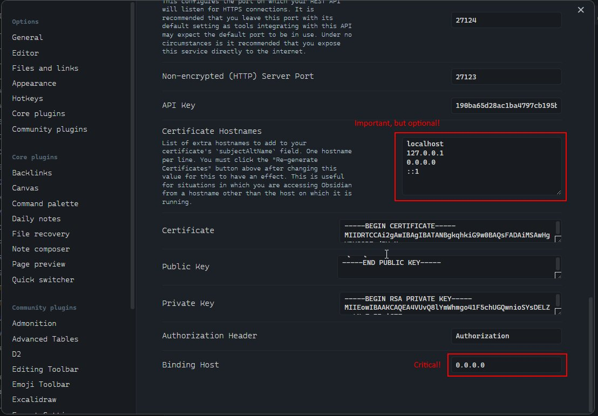

# mcp-obsidian

[](https://github.com/OleksandrKucherenko/mcp-obsidian-via-rest/actions/workflows/npm-publish.yml) [](https://github.com/OleksandrKucherenko/mcp-obsidian-via-rest/actions/workflows/docker-publish.yml)

<!-- TOC -->

- [mcp-obsidian](#mcp-obsidian)
  - [Configure MCP](#configure-mcp)
  - [Setup and Troubleshooting](#setup-and-troubleshooting)
    - [Setup](#setup)
    - [Verify that Obsidian REST API is running Windows Host, MacOD, Linux](#verify-that-obsidian-rest-api-is-running-windows-host-macod-linux)
    - [WSL2, Docker hosted on Ubuntu](#wsl2-docker-hosted-on-ubuntu)
    - [Verify Windows Firewall](#verify-windows-firewall)
    - [Disable/Enable Firewall](#disableenable-firewall)
    - [Verify Connectivity on BusyBox Container](#verify-connectivity-on-busybox-container)

<!-- /TOC -->

## Configure MCP 

```jsonc
{
  "mcpServers": {
    "obsidian": {
      "command": "docker",
      "args": [
        "run",
        "--name", "mcp-obsidian-windsurf",
        "--interactive",
        "--rm",
        "-e", "API_KEY",
        "-e", "API_HOST",
        "-e", "API_PORT",
        "-e", "DEBUG",
        "ghcr.io/oleksandrkucherenko/obsidian-mcp:latest"
      ],
      "env": {
        "API_KEY": "<secret_key>",         // required
        "API_HOST": "https://172.26.32.1", // default: localhost
        "API_PORT": "27124",               // default: 27124
        "DEBUG": "mcp:*"                   // default: disabled logs
      }
    } 
  }
}
```

- `--rm`  - Automatically remove the container and its associated anonymous volumes when it exits
- `-i, --interactive` - Keep STDIN open
- `-e, --env` - Set environment variables
- `--name string` - Assign a name to the container

- [NPM Package Releases](https://github.com/OleksandrKucherenko/mcp-obsidian-via-rest/pkgs/npm/mcp-obsidian)
- [Docker Image Releases](https://github.com/OleksandrKucherenko/mcp-obsidian-via-rest/pkgs/container/obsidian-mcp)

## Setup and Troubleshooting

### Setup

- Run [Obsidian Desktop Application](https://obsidian.md/) and enable [Local REST API](https://github.com/coddingtonbear/obsidian-local-rest-api) in Settings.



This setting will allow to connect to Local REST API from any network interface (not only localhost, which is critical for WSL2 setup).

- Copy API Key from Obsidian Settings, you will need it for MCP configuration.

- Verify that Obsidian Local REST API is running and accessible from your machine.

- Next Step is always verify the network setup on your machine (firewall rules, etc).

### Verify that Obsidian REST API is running (Windows Host, MacOS, Linux)

Run in Windows CMD terminal:

```shell
# windows CMD, verify that port is listening (that rest api is running)
netstat -an | findstr 27124
# Expected output:
#   TCP    0.0.0.0:27124           0.0.0.0:0               LISTENING

# Verify that Obsidian Local REST API is working
curl --insecure https://localhost:27124
wget --no-check-certificate -S https://localhost:27124
http --verify=no https://localhost:27124
```

Expected REST API response:

```json
{
  "status": "OK",
  "manifest": {
    "id": "obsidian-local-rest-api",
    "name": "Local REST API",
    "version": "3.2.0",
    "minAppVersion": "0.12.0",
    "description": "Get, change or otherwise interact with your notes in Obsidian via a REST API.",
    "author": "Adam Coddington",
    "authorUrl": "https://coddingtonbear.net/",
    "isDesktopOnly": true,
    "dir": ".obsidian/plugins/obsidian-local-rest-api"
  },
  "versions": {
    "obsidian": "1.8.10",
    "self": "3.2.0"
  },
  "service": "Obsidian Local REST API",
  "authenticated": false
}
```

### WSL2, Docker hosted on Ubuntu


Run inside the WSL2 Ubuntu Terminal:

```bash
export WSL_GATEWAY_IP=$(ip route show | grep -i default | awk '{ print $3}')
echo $WSL_GATEWAY_IP # expected something like: 172.26.32.1

# Verify that Obsidian Local REST API is working 
curl --insecure https://$WSL_GATEWAY_IP:27124
wget --no-check-certificate -S https://$WSL_GATEWAY_IP:27124
http --verify=no https://$WSL_GATEWAY_IP:27124
```

### Verify Windows Firewall

Run GUI and Setup Manual The Rules:

```shell
# Windows Defender Firewall / Inbound Rules. Press Win+R and type WF.msc or firewall.cpl
WF.msc
firewall.cpl # and then press 'Advanced settings'
```

Or Run in Windows PowerShell as Administrator:

```shell
# Add firewall rule to allow port 27124 (Run in Admin PowerShell)
New-NetFirewallRule -DisplayName "WSL2 Obsidian REST API" -Direction Inbound -LocalPort 27123,27124 -Protocol TCP -Action Allow
```

Or Run in Windows CMD terminal:

```shell
# check firewall rules (CMD) that manage 27124 port
netsh advfirewall firewall show rule name=all | findstr /C:"Rule Name" /C:"LocalPort" /C:"RemotePort" | findstr /C:"27124"

# display rules that has WSL2 keyword in own name
netsh advfirewall firewall show rule name=all | grep -A 13 WSL2

# display rule definition by port number (4 line after, 9 lines before)
netsh advfirewall firewall show rule name=all | grep -A 4 -B 9 27124
```

### Disable/Enable Firewall

Execute in Windows PowerShell as Administrator:

```shell
# Temporarily turn off firewall (for testing ONLY, not recommended for regular use)
Set-NetFirewallProfile -Profile Domain,Public,Private -Enabled False

# Restore Firewall state
Set-NetFirewallProfile -Profile Domain,Public,Private -Enabled True
```

### Verify Connectivity on BusyBox Container

This steps allows to confirm that the network setup is correct and the container can connect to the Local REST API.

Execute inside the WSL2 Ubuntu terminal:

```bash
export WSL_GATEWAY_IP=$(ip route | grep default | awk '{print $3}')
echo "Windows host IP from WSL2: $WSL_GATEWAY_IP"
# Output:
#   Windows host IP from WSL2: 172.26.32.1

# run docker container to verify the connectivity from Docker inside
docker run --rm -it --network=host busybox sh

# inside the container run:
which wget
# /bin/wget

export WINDOWS_HOST_IP="172.26.32.1"
echo $WINDOWS_HOST_IP
# 172.26.32.1

# try to connect to the Local REST API
wget -qO- --no-check-certificate "https://$WINDOWS_HOST_IP:27124"
wget -qO- --no-check-certificate https://172.26.32.1:27124
```
